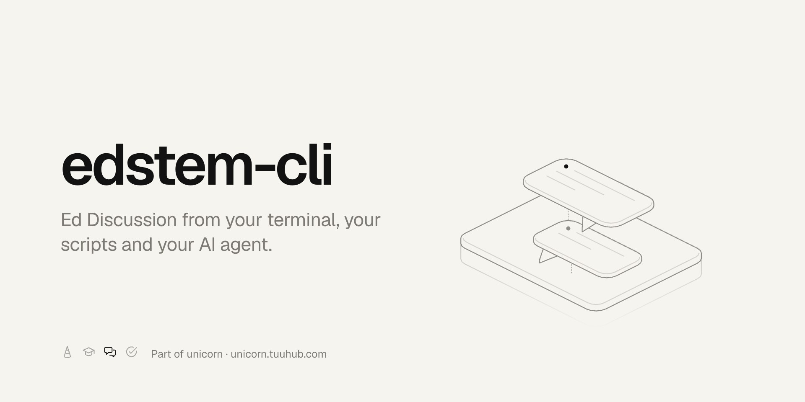

<p align="center"><a href="https://unicorn.tuuhub.com"></a></p>

# edstem-cli

**CLI and MCP access to Ed Discussion for people, scripts, and agents.**

[](https://www.npmjs.com/package/edstem-cli)
[](https://github.com/bunizao/edstem-cli/actions/workflows/ci.yml)
[](https://nodejs.org/)
[](LICENSE)

> The live layer of [unicorn](https://unicorn.tuuhub.com): live tools answer what is there now, unicorn answers what changed. Docs: [unicorn.tuuhub.com/docs/edstem](https://unicorn.tuuhub.com/docs/edstem).

## Quick start

Create a token at [edstem.org/settings/api-tokens](https://edstem.org/settings/api-tokens), then:

```bash
npm install -g edstem-cli
edstem auth login
edstem units
edstem threads UNIT --unread --limit 20
```

To connect an AI client instead, see [MCP](#mcp).

## Install and sign in

```bash
npm install -g edstem-cli

# Recommended: verify a token once and save it to ~/.config/edstem-cli/token.
edstem auth login

# Or, for scripts and CI:
export EDSTEM_TOKEN="your-token"
export EDSTEM_REGION="au" # au, us, or eu

edstem auth status
```

Create a token at [edstem.org/settings/api-tokens](https://edstem.org/settings/api-tokens) while signed in to the Ed region you use. `edstem auth login` prompts for the token without echoing it, then detects the region by trying the token against AU, US, and EU, and asks you to pick one only if it cannot tell (the token is accepted nowhere or in more than one). It verifies the token against that region before saving `{ "token": "...", "region": "au" }` together in `~/.config/edstem-cli/token` with `0600` permissions. Subsequent CLI commands and the local stdio MCP server use the saved region automatically. Existing plain-text token files remain supported and default to AU.

| Region | API endpoint |
| --- | --- |
| `au` (Australia) | `https://edstem.org/api/` |
| `us` (United States) | `https://us.edstem.org/api/` |
| `eu` (Europe) | `https://eu.edstem.org/api/` |

Use `--region` (or `EDSTEM_REGION`) to skip detection and `--token-stdin` to read a token from stdin. Non-interactive login detects the region too, and fails with a request for `--region` when it cannot tell. `edstem auth logout` removes the saved credentials, and `edstem auth status` reports the active region, where that region came from (`environment`, `file`, or `default`), and the token source. `EDSTEM_TOKEN` takes precedence over the saved token; when using it, set `EDSTEM_REGION` for US or EU (it defaults to AU independently of the saved file). `EDSTEM_REGION` can also override the saved region, and `EDSTEM_BASE_URL` overrides the API endpoint. The CLI also reads `~/.config/edstem-cli/config.yaml`.

```bash
printf '%s\n' "your-token" | edstem auth login --region us --token-stdin
edstem auth logout --yes
```

Run `edstem update --check` to compare the installed version against npm, or `edstem update --yes` to install the latest release.

## Command model

Commands follow `edstem <plural-noun> [verb] [scope] [id] [flags]`. The canonical enrolment noun is `units`; `courses` and `projects` are equivalent aliases.

```bash
edstem units
edstem courses UNIT
edstem threads 12345 --limit 20 --fields id,number,title
edstem threads search 12345 assignment deadline
edstem threads show 12345#42
edstem threads show UNIT#42
edstem threads read 12345#42
edstem lessons 12345 --module "Week 2"
edstem lessons show 67890
edstem lessons read 67890
```

Omitted verbs are inferred when the arguments are unambiguous. `read` always emits Markdown and never changes upstream state; it is available for threads, lessons, and slides.

### Unit arguments and filters

Every `<unit>` argument (`UNIT` above) accepts either the numeric Ed course ID or the course code exactly as Ed shows it; run `edstem units` to see both. The CLI never assumes what a code looks like. MCP tools use the same rule for `courseId`, so a code can be passed directly without a preceding `list_courses` lookup. If multiple enrolments share a code, use the numeric ID shown by `edstem units --archived` to select the intended year and session.

Lesson filters are case-insensitive. `--module` accepts an ID or part of a module name; `--type`, `--state`, and `--status` use exact values. Common lesson values are `general`, `active` or `scheduled`, and `unattempted`, `attempted`, or `completed`. Pass `all` or omit a filter to include every value. If an unfiltered lesson list is empty, that unit has no Ed Lessons; an invalid filter reports the values available in that unit.

Thread categories are hierarchical: `--category` matches the top level and `--subcategory` matches the second level. Thread sorting defaults to `new`; Ed may keep pinned threads first regardless of the selected order.

Ed applies none of these filters itself, so `--limit` is honoured by paging through Ed until enough threads match, up to ten requests. `--offset` skips threads at the start of the unfiltered Ed stream. `--since` keeps threads created at or after an ISO date, an ISO datetime, or a relative offset such as `7d`, `12h`, or `2w`. `threads search` matches every query word, case-insensitively, against the thread title and body, and accepts the same filters as `threads list`.

```bash
edstem threads 12345 --category "<top-level category>" --subcategory "<second-level>"
edstem threads 12345 --unanswered --since 7d --limit 20
edstem threads search 12345 assignment deadline --since 2026-09-01
edstem lessons 12345 --module "<part of a module name>" --status all
```

### Thread state actions

Thread state actions use paired verbs and the same confirmation gate as posting:

```bash
edstem threads star UNIT#42 --dry-run
edstem threads watch UNIT#42 --yes
edstem threads unwatch UNIT#42 --yes
edstem threads upvote UNIT#42 --comment 88991 --yes
edstem threads mark-unread UNIT#42 --yes
edstem threads mark-read UNIT --all --yes
```

The full set is `star`, `unstar`, `watch`, `unwatch`, `upvote`, `unvote`, `mark-read`, and `mark-unread`. Each command fetches the thread while preparing its plan and skips the write if the requested state already applies. Votes can target a comment belonging to that thread with `--comment`; other actions target the thread. `watch` explicitly enables notifications and `unwatch` explicitly disables them, overriding the course default. `threads show` includes `isStarred`, `isWatched` (including `null` for the course default), and `vote`. Writes are never retried. These actions are CLI-only; the MCP tool catalog is unchanged.

### Catch up since your last visit

`--unread` selects threads Ed reports as unseen. `--since last` instead selects threads created since the last successful unrestricted catch-up listing:

```bash
edstem threads UNIT --unread --limit 20
edstem threads UNIT --since last --limit 100
```

The cursor lives in `~/.config/edstem-cli/state.json`, keyed by numeric course ID so enrolments with repeated codes stay separate. On first use it looks back seven days. After a successful, complete listing it advances to the request's start time. Search, content filters (including answered and unread), nonzero offsets, and non-new sort orders never advance it. Results reaching `--limit` or the ten-page cap leave it unchanged and print a warning to stderr. Fetch or output failures leave it unchanged too. This changes local state only; listing and `read` commands never mark threads read in Ed.

### Export a forum

Export a forum as a portable Markdown archive:

```bash
edstem threads export UNIT --dest ./archive
edstem threads export UNIT --dest ./archive --since 2026-07-01 --no-files
edstem threads export UNIT --dest ./archive --force
```

The archive contains `index.md` (number, title, category, author, date, replies), `threads/0042-title.md`, `files/0042/<attachment>`, and `manifest.json` with the numeric unit ID, export time, thread IDs, and index entries. Export accepts the listing filters and has no default limit or ten-page cap. It requests details sequentially, downloads Ed-hosted attachments from the post and nested comments, and rewrites their Markdown links to local paths. An attachment list also preserves files omitted by Ed's plain-text document. `--no-files` retains remote links.

Completed thread files are skipped on subsequent runs, including their detail requests and downloads, so an interrupted export resumes. `--force` rewrites completed threads. This is a resumable snapshot; it does not automatically refresh changed threads or remove old files. Use a separate destination for each unit. Export never advances the catch-up cursor. Progress goes to stderr; stdout contains only `{ dest, threads, skipped, files }`, where `threads` counts files written in this run.

### Lesson and thread files

Lesson files include PDF slides stored in Ed's `file_url` field and Ed-hosted files embedded in lesson content. List them without downloading, or download all files to a directory. External links remain visible in lesson content but are not presented as downloadable files. Existing files are protected unless `--force` is supplied.

A target is a lesson ID, or a thread prefixed with `thread:`. Thread targets collect the attachments in the thread body, its answers, and every nested comment; `--slide` applies to lesson targets only.

```bash
edstem files list 67890
edstem files get 67890 --dest ./slides
edstem files get 67890 --slide 4401 --dest ./slides
edstem files list thread:5001
edstem files get thread:UNIT#42 --dest ./attachments
```

### Slides

Slide facets use one read-only command so the verb vocabulary stays consistent:

```bash
edstem slides show 4401
edstem slides show 4401 --section questions
edstem slides show 4401 --section responses
edstem slides read 4401
```

## Mutations

Mutations are visible in help, print a plan, and prompt with `y/N` in an interactive terminal. Non-interactive callers must pass `--yes`. `--dry-run` prints the plan without sending a write request.

In a terminal, a command missing its unit asks for it with a picker (`edstem threads` lists your units), and `threads send` asks for `--title` and opens `$EDITOR` for the body. Pipes, `--json` and agent shells get the usage error with the usage line instead.

```bash
edstem lessons mark-read 12345 Pre-Reading --dry-run
edstem lessons mark-read 12345 Pre-Reading --yes

# Marking the whole unit needs --all; queries alone never match everything.
edstem lessons mark-read 12345 --all --yes

# Save one answer, then submit all saved answers for the slide.
edstem slides submit 4401 --question 991 --choice 2 --yes
edstem slides submit 4401 --yes
```

### Posting

Posting request and response formats have been checked with mocked Ed responses only; they have not been verified against the live Ed API. `--dry-run` previews the generated document and plan, but does not validate the live API contract.

Posting publishes to the unit forum under your own name and cannot be undone from this tool. Review the plan first with `--dry-run`, which also prints the Ed XML that will be sent.

```bash
edstem threads send 12345 --title "Week 3 sample solution" --body "Does **Q4** need induction?" --dry-run
edstem threads send UNIT --title "Week 3 sample solution" --body-file ./post.md --type question --category "<top-level category>" --yes
edstem replies send 12345#42 --body "Fixed by reinstalling." --yes
edstem replies send 12345#42 --to 88991 --as comment --body-file - --yes
```

The body is Markdown and is converted to Ed's document format: paragraphs, headings, fenced code, inline code, bold, italic, links, and bullet or numbered lists. `--body-file -` reads the body from stdin; with neither flag, a terminal opens `$EDITOR`. `--as` defaults to `answer` on question threads and `comment` elsewhere; `--private` posts to staff only and `--anonymous` hides your name from other students.

The MCP tools `create_thread` and `reply_thread` are disabled by default. Set `EDSTEM_ALLOW_POSTING=1` for the stdio server, or the Worker variable `MCP_ALLOW_POSTING=1`, to enable them.

## Output and errors

Successful output is a table when stdout is a terminal and JSON when stdout is piped or redirected. Override this with `--json`, `--yaml`, or `--table`; select fields with `--fields a,b`; write to a file with `--output FILE`.

Errors are rendered exactly once on stderr. Usage failures exit 2, authentication failures exit 3, missing entities exit 4, upstream rejections exit 5, and cancellation exits 130.

Run `edstem commands --json` for the full machine-readable command tree, including aliases, positionals, enum values, and mutation markers.

## Environment

| Variable | Purpose |
| --- | --- |
| `EDSTEM_BASE_URL` | Override the Ed JSON API base URL. |
| `EDSTEM_TOKEN` | Provide the Ed API token. |
| `EDSTEM_REGION` | Select `au`, `us`, or `eu`; overrides the saved region. Environment tokens default to AU. |
| `EDSTEM_CONFIG` | Override the local config file path. |
| `EDSTEM_ALLOW_POSTING` | Set to `1` to enable the `edstem-mcp` posting tools. |
| `EDSTEM_WIDGETS` | Set to `0` to drop the interactive `show_*` tools from `edstem-mcp`. |

`config.yaml` also tunes read retries: `rateLimit.maxRetries` (default `3`) caps how many times a rate-limited or temporarily failing GET is retried, and `rateLimit.retryBaseDelay` (seconds, default `1.0`) sets the exponential backoff base. A longer `Retry-After` header wins. Writes are never retried.

## MCP

The package also installs `edstem-mcp`, a local stdio MCP server using the same saved token and region, or `EDSTEM_TOKEN` and `EDSTEM_REGION`. A hosted Streamable HTTP server is available at `https://edstem.tuuhub.com/mcp` and uses OAuth.

The remote runtime supports MCP `2026-07-28`, including stateless `server/discover`, header-based routing, and results with `resultType`. It also keeps a stateless compatibility lane for 2025 Streamable HTTP clients during migration.

The read-only `list_lesson_files` and `list_thread_files` tools return compact file metadata plus MCP resource links. Remote MCP servers cannot write to a client's local path, so clients can follow those links while the CLI's `files get` command handles direct filesystem downloads.

### Interactive views

In hosts that support [MCP Apps](https://github.com/modelcontextprotocol/ext-apps) (Claude and ChatGPT among them), four tools render an interactive view in the chat instead of a wall of text:

| Tool | Shows |
| --- | --- |
| `show_forum_catchup` | Unread announcements and threads that are new to you or have new replies, each expandable in place. |
| `show_thread_activity` | New threads per week, stacked by category, with each week expandable to its busiest threads. |
| `show_lesson_progress` | Completed lessons per released module, with what is left on click. |
| `show_lesson_guide` | A step-through guide the assistant writes for one lesson, then a short practice quiz graded in place. The lesson's own Ed quiz is never answered. |

Views are the default. Ask for a plain-text answer and the assistant uses the `list_*` and `read_*` tools instead; hosts without MCP Apps get the same data as text; and `EDSTEM_WIDGETS=0` removes the `show_*` tools from the stdio server. The `teach_lesson` prompt runs the lesson guide end to end.

```json
{
  "mcpServers": {
    "edstem": {
      "command": "edstem-mcp",
      "env": {
        "EDSTEM_TOKEN": "your-token"
      }
    }
  }
}
```

### Cloudflare Worker

[](https://deploy.workers.cloudflare.com/?url=https://github.com/bunizao/edstem-cli)

The button copies this repository to your Git provider and deploys `src/worker.ts`. The Worker uses no database, storage binding, or protocol session. Clients send an Ed access token or API key with each request; the Worker validates the credential without storing it. The hosted OAuth service stores the Ed token encrypted with AES-256-GCM instead. Verified tokens are cached in memory for five minutes per isolate, so repeated calls skip the extra Ed verification round-trip; set `MCP_TOKEN_CACHE_TTL_SECONDS=0` to disable it.

After deployment, the endpoints are:

```text
https://<worker-host>/mcp
https://<worker-host>/healthz
```

See the [MCP setup guide](MCP_SETUP.md) for manual deployment, credential-storage details, Worker configuration, and connection steps for ChatGPT web, Codex, and Claude connectors.

For client-specific setup see the [MCP docs](https://unicorn.tuuhub.com/docs/mcp).

## Agent skill

```bash
npx skills add https://github.com/bunizao/edstem-cli
edstem skills generate
```

The tracked [SKILL.md](SKILL.md) is generated from `edstem commands --json` plus the MCP tool catalog. CI rejects drift. The shared CLI contract comes from the published `@bunizao/cli-kit` npm package (`^0.5.0`).

## Part of unicorn

unicorn is one project in two layers. The live tools answer what is there now; unicorn answers what changed.

| Project | Layer | What it does | Repo |
| --- | --- | --- | --- |
| unicorn | Memory | A Cloudflare Worker on your own account. Reads Moodle, Ed, Canvas, Gmail and feeds every hour, remembers what each said, and tells your AI agent what changed. | [TuuHub/unicorn](https://github.com/TuuHub/unicorn) |
| moodle-cli | Live | Moodle from the terminal and MCP: units, deadlines, grades, forums, files, submissions. | [bunizao/moodle-cli](https://github.com/bunizao/moodle-cli) |
| **edstem-cli** (you are here) | **Live** | **Ed Discussion from the terminal and MCP: units, threads, lessons, files, posting.** | [bunizao/edstem-cli](https://github.com/bunizao/edstem-cli) |
| ontrack | Live | OnTrack / Doubtfire from the terminal: units, tasks, chats, submissions. CLI only, no MCP server. | [bunizao/ontrack-cli](https://github.com/bunizao/ontrack-cli) |

The three live tools share one command contract through [@bunizao/cli-kit](https://github.com/bunizao/cli-kit).
Docs for everything: [unicorn.tuuhub.com/docs](https://unicorn.tuuhub.com/docs). This project: [unicorn.tuuhub.com/docs/edstem](https://unicorn.tuuhub.com/docs/edstem). CLIs overview: [unicorn.tuuhub.com/cli](https://unicorn.tuuhub.com/cli).

## License

[MIT](LICENSE). See [THIRD_PARTY_NOTICES.md](THIRD_PARTY_NOTICES.md) for migrated remote MCP attribution.
